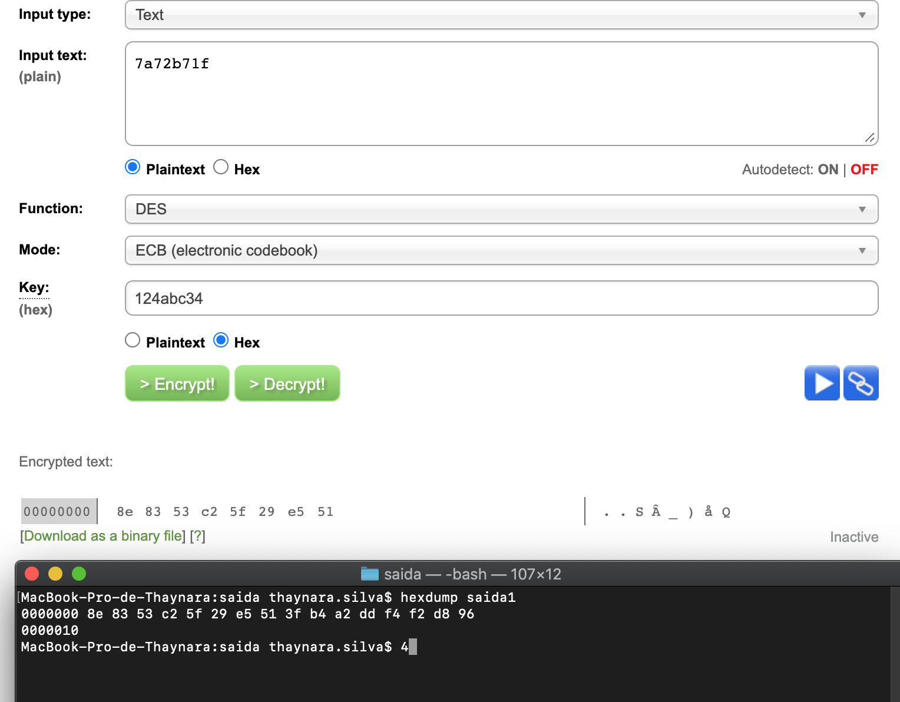

# Estudo sobre DES

Foi criado 10 arquivos, cada arquivo contem um texto claro de 64 bits.

Cada arquivo foi submetido a criptografia no metodo de DES utlizando o openSSL, com a chave ```124abc34```. 

Comando usado para criptografar:
 
```openssl enc -des-ecb -K 124abc34 -in entrada -out saida```

Texto claro:

``` 
7a72b71f

123bc201

12354322

abcdef61

23bc0912

fca23098

0983bc11

2345bc13

343f4533

34564597 
```

Comparação do metodo openSSL e uma [ferramenta online](http://des.online-domain-tools.com/).




Comparanda as duas ferramentas quando convertia o arquivo criptografado com o openSSL ele fazia padding por essa razão no scrip em python trunca os primeiros 64 bits do resultado. Para assim fazer a comparação. 